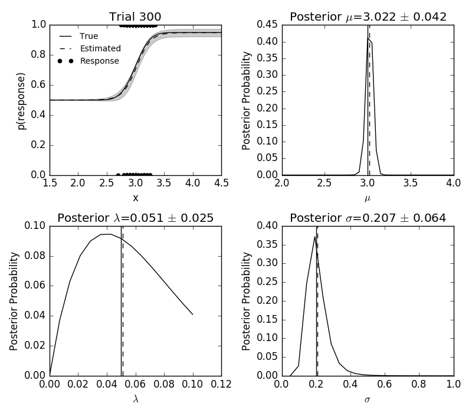

# PsiMarginal
Psi adaptive staircase procedure for use in psychophysics.

## Authors:
Nynke Niehof, James Cooke, Radboud University Nijmegen

## License:
Copyright © 2016, N. Niehof, Radboud University Nijmegen

PsiMarginal is free software: you can redistribute it and/or modify
it under the terms of the GNU General Public License as published by
the Free Software Foundation, either version 3 of the License, or
(at your option) any later version.

PsiMarginal is distributed in the hope that it will be useful,
but WITHOUT ANY WARRANTY; without even the implied warranty of
MERCHANTABILITY or FITNESS FOR A PARTICULAR PURPOSE.  See the
GNU General Public License for more details.

You should have received a copy of the GNU General Public License
along with PsiMarginal. If not, see <http://www.gnu.org/licenses/>.

## Description:
Find the stimulus intensity with minimum expected entropy for each trial, to determine the psychometric function.
Psi adaptive staircase procedure for use in psychophysics, as described in Kontsevich & Tyler (1999)
and psi-marginal staircase as described in Prins(2013). Implementation based on the Palamedes toolbox (version 1.8.1) for Matlab.

## Installation:

`pip install https://github.com/DominiqueMakowski/Psi-staircase/zipball/master`

### References:
Kontsevich, L. L. & Tyler, C. W. (1999). Bayesian adaptive estimation of psychometric slope and threshold. Vision Research, 39, 2729-2737.

Prins, N & Kingdom, F. A. A. (2009). Palamedes: Matlab routines for analyzing psychophysical data. http://www.palamedestoolbox.org

Prins, N. (2013). The psi-marginal adaptive method: How to give nuisance parameters the attention they deserve (no more, no less). Journal of Vision, 13(7):3, 1-17.

## How to use:
Create a psi object instance with all relevant arguments. Selecting a correct search space for the threshold,
slope, guessing rate and lapse rate is important for the psi procedure to function well. If an estimate for
one of the parameters ends up at its (upper or lower) limit, the result is not reliable, and the procedure
should be repeated with a larger search range for that parameter.

The stimulus intensity to be used in the current trial can be found in the field xCurrent.

After each trial, update the psi staircase with the subject response, by calling the addData method.

The current posterior can be plotted by calling PsiMarginal.plot(). The mean estimate of the parameters can be
obtained by calling psi.eThreshold, psi.eSlope, psi.eLapse.

For further information, see class documentation.

A demo illustrating how to use the algorithm is provided in demo.py. demo.py runs the algorithm on a simulated subject, plots the marginal posterior for each parameter (including the corresponding mean +- sd) and also plots the mean +- sd of the posterior psychometric curve. An example output of demo.py is below.

